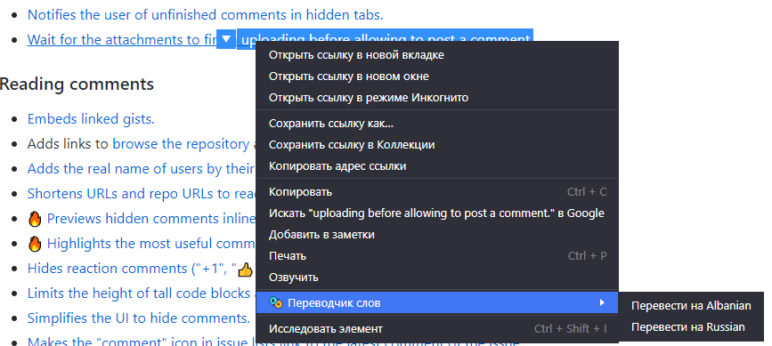

# Translate Words Extension For Google Chrome
Расширение для Google Chrome позволяет целиком переводить страницу. А также переводить выделенный фрагмет текста на странице, с последующей его заменой на перевод.

Контекстное меню

